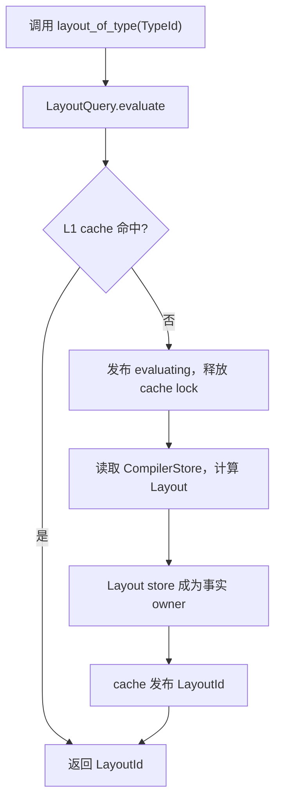
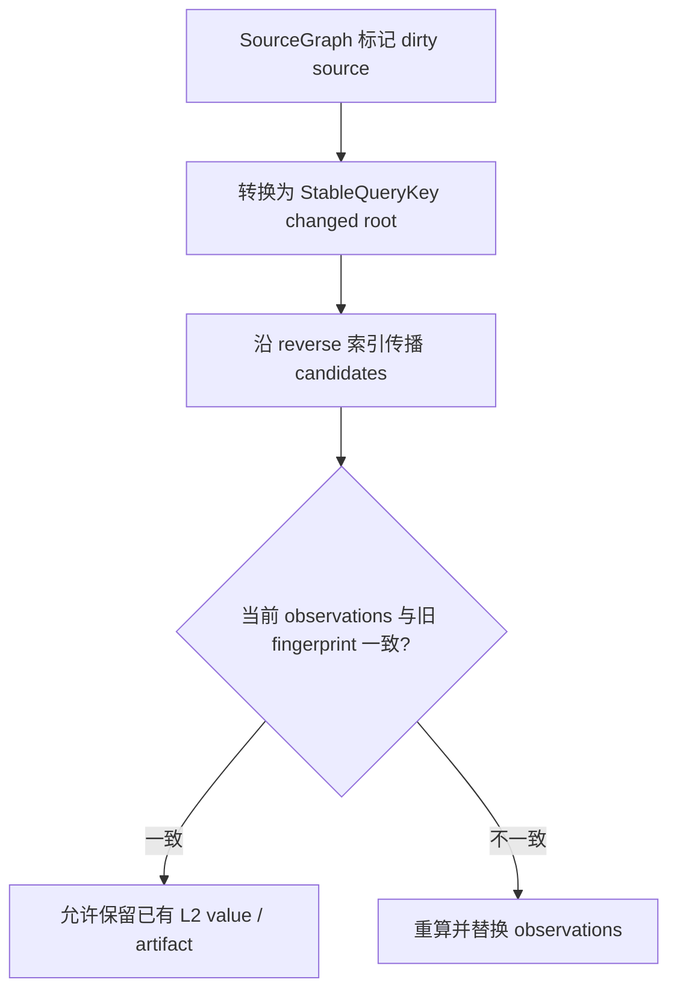

# Database：查询驱动的编译器求值层

Database 不是新的事实存储，也不是把编译器改成常驻服务。它是一层同步求值机制：
调用方用 typed key 请求一个编译事实；对应查询负责取得结果、缓存本轮答案，并记录
可持久化结果所依赖的稳定输入。

这次重构首先解决两个问题：

1. 阶段代码不再依赖一个可随意改写的完整 `CompilerContext&!`；
2. 同一编译事实只有一个 owner，查询缓存只保存轻量句柄、指纹或完成状态。

增量编译是这套边界带来的能力，但不能倒过来破坏所有权设计。没有真实 L2 artifact
的查询只能获得本轮 L1 memo，不能因为存在依赖图就宣称可以跨进程复用。

## 1. 设计边界

### 1.1 Database 负责什么

- 为每种查询提供独立的 typed cache；
- 定义查询的 compute、publish 和重入语义；
- 在 compilation epoch 开始时统一重置 session cache；
- 记录稳定查询之间的依赖 observation；
- 从 changed roots 传播失效候选，并比较依赖指纹；
- 记录有业务意义的 L2 恢复和失效候选。

### 1.2 Database 不负责什么

- 不拥有 AST、Semantic Model、TypeFacts、JIL 或 borrow facts；
- 不复制 `CompilerStore` 中已有的事实；
- 不把 session-local ID 序列化成新 artifact；
- 不持久化普通 AST，也不为批处理编译器保留常驻内存 cache；
- 不在查询层创建 task、job、等待队列或 single-flight 调度；
- 不用 `unsafe`、宽泛 `@life`、snapshot 或双 provenance 绕过所有权检查。

并行仍属于 pipeline 的外层阶段调度。0.5.2 的 Database 保持同步。

### 1.3 结果从哪里取得

| 层级 | 内容 | 生命周期 |
| --- | --- | --- |
| L1 | typed query wrapper 中的 `QueryCache` | 当前 compilation epoch |
| L2 | `.ji`、`.o`、`.mono.o`、`.jbuild` 中的真实 value/artifact | 跨进程 |
| L3 | 读取 owner store 并执行实际计算 | 当前求值 |

查询总是先查 L1。只有该查询确实定义了 L2，L1 miss 后才尝试读取 L2；否则直接进入 L3。
L2 命中和 L3 计算出的结果都会发布回本轮 L1。依赖 observation 可以随 L2 恢复，但
observation 本身不是 QueryValue。

## 2. 所有权结构

```text
CompilerContext
  store: CompilerStore
    跨阶段共享事实的唯一 owner
    TypeStore / Semantic Model / TypeCheckStore / LayoutStore / ...

  query: QueryEngine
    typed query wrappers
      每种查询一个 wrapper
      wrapper 内部持有自己的 QueryCache<K, V>
    dependencies: QueryDependencyGraph
    JIL Store identity allocator

阶段产物
  JIL Store / ObjectUnit / ...
  由对应阶段的明确 owner 持有

持久层
  .ji / .o / .mono.o / .jbuild
```

边界如下：

- `CompilerStore` 拥有跨阶段共享事实，阶段产物由对应阶段的明确 owner 持有；
- typed query wrapper 拥有该查询的求值状态和 L1 memo；
- `QueryEngine` 聚合 wrappers、依赖图和 session 级辅助机制；
- artifact store 拥有能够跨进程复用的 L2 数据；
- `QueryDependencyGraph` 只拥有稳定依赖关系，不拥有查询结果。

例如 layout 查询缓存 `LayoutId`，真正的 `Layout` 仍由 layout store 持有；JIL body 查询缓存
`FunctionId`，真正的 function/body 仍由 JIL Store 持有。

如果某个 Movable 查询结果没有既有 owner，wrapper 可以成为它唯一的明确 owner，同时让
`QueryCache` 只保存 Copyable ID。generic instance plan 属于这种情况，见 §6.4。

源码对应关系：

| 位置 | 职责 |
| --- | --- |
| `src/db.jiang` | Database 对外模块入口 |
| `src/db/query_engine.jiang` | `QueryEngine`、稳定 facade 和跨查询协调 |
| `src/db/query_cache.jiang` | 通用同步 memo 原语 |
| `src/db/*_query.jiang` 及各 typed query 文件 | 查询 wrapper 与业务求值语义 |
| `src/db/query_dependency.jiang` | 稳定依赖图、失效传播和 fingerprint 裁决 |

## 3. 为什么每种查询需要 wrapper

`QueryCache<K, V>` 只是通用 memo 原语，不知道 `K` 和 `V` 的业务含义，也不知道遇到重入时
应该返回错误、已有结果还是跳过计算。

每种 typed query 因此由一个轻量 wrapper 表达：

```text
LayoutQuery
  cache: QueryCache<Int, LayoutId>
  evaluate(store, TypeId) -> LayoutId

TypeCheckDefQuery
  cache: QueryCache<DefId, TypeId>
  evaluate(DefId, evaluator) -> TypeId
```

wrapper 负责：

- 定义 typed key 和 typed value；
- 把 session key 转换成 cache key；
- 决定 L1 miss 后如何 compute 或 load；
- 定义 evaluating 状态的业务含义；
- 把完成值发布进 cache；
- 暴露 epoch reset。

wrapper 不再建立自己的 active set、完成值表或第二套状态机。所有 missing / evaluating / ready
状态仍由内部唯一的 `QueryCache<K, V>` 表达。

查询的稳定外部入口保留在 `query_engine.jiang`。入口只做路由和跨查询协调；具体查询业务在
对应 wrapper 内。这样调用方不依赖 wrapper 的内部存储，`QueryEngine` 也不会膨胀成所有查询
实现的集合。

## 4. QueryCache

`QueryCache<K, V>` 的核心结构是：

```text
entries: WyHashMap<K, V?>
```

一张表表达三种状态，`state(key)` 原子读取并在 missing 时占位：

| 表中状态 | `QueryCacheState` | 含义 |
| --- | --- | --- |
| 没有 key | `missing` | 写入 `key -> null`，由当前调用方求值 |
| `key -> null` | `evaluating` | 当前 key 正在求值；wrapper 决定是否视为环 |
| `key -> value` | `ready` | 结果已经发布；wrapper 从 cache 读取值 |

状态转换只有两条正常路径：

```text
missing -> state(key) -> evaluating -> complete(key, value) -> ready
missing/ready -> publish(key, value) -> ready
```

`publish` 用于 L2 恢复或已有 owner 事实的直接发布；普通递归查询使用 `state + complete`。

`K` 和 `V` 都是 `Copyable`。cache 不保存带长生命周期借用的大对象，只保存 ID、fingerprint、
布尔状态等轻量值。Movable 结果由独立 owner 持有，cache 只保存指向该 owner 的 Copyable ID。

每个 wrapper 用自己的 `Mutex<QueryCache<...>>` 提供固定地址的共享入口。锁只保护一次
state/complete 操作，compute 和 L2 I/O 必须在锁外执行。因此同步 Database 不会在递归
查询期间持有 cache 借用，也不会把 mutex 变成隐式的查询调度器。

## 5. QueryEngine

`QueryEngine` 是一次编译会话的求值容器。它只聚合：

- 各种 typed query wrapper；
- 一个独立的 `QueryDependencyGraph`；
- JIL Store query identity allocator 等明确命名的 session 机制。

它不直接持有裸 `QueryCache`，也不再使用混合无关状态的 `QueryControlState`。

`QueryEngine.reset()` 定义 epoch 边界：

1. 清空每个 wrapper 的 L1 cache；
2. 重置 JIL Store session identity；
3. 清空依赖图中的 changed roots、candidates 和本轮恢复统计；
4. 保留稳定依赖边。

在批处理模式下，进程退出后 L1 和内存中的依赖图都会消失。下一次进程能够恢复的只有
明确写入 `.ji`、object 或 `.jbuild` 的 L2 数据和稳定 observation，不能依赖上一个
进程的内存状态。

## 6. 一次查询如何执行

### 6.1 只有 L1 的叶子查询

layout 是最直接的例子：它没有持久化 QueryValue。



同一个 `TypeId` 在本轮只计算一次；下一次编译仍需重新计算，因为不存在 layout L2 artifact。

### 6.2 带 L2 的稳定查询

module interface 查询的取得顺序是：

1. 查 wrapper 的 L1 cache；
2. L1 miss 时调用 load callback 读取或构造 L2-backed 事实；
3. owner store 接管事实，wrapper 只缓存 `SourceId`；
4. 用稳定 source identity 和 fingerprint 记录 observation；
5. 返回 owner handle。

L2 I/O 不属于 `QueryCache`。wrapper 接收窄能力 callback，避免持有完整的 artifact store 或
`CompilerContext&!`。

### 6.3 有递归语义的 session 查询

type-check def/node、trait dependency 和 JIL body 等查询需要区分：

- `ready`：直接使用已有结果；
- `evaluating`：发生本查询定义下的重入或环；
- `missing`：当前调用方负责计算并最终 publish。

wrapper 负责解释这三种状态。以 def-type 和 node-type 查询为例，ready 直接返回 `TypeId`；
missing 调用 compute callback 并发布结果；evaluating 调用 cycle callback。trait dependency
沿用相同协议，但结果只是“依赖检查已完成”。JIL body 的重入表示当前实例正在 lowering，
wrapper 返回空结果而不重复 lowering。调用方不接触 begin/finish，也不能构造无效状态组合。

borrow check 与 drop elaboration 也各有自己的 wrapper：前者 memo 接受状态，后者的 cache 只记录
给定 JIL Store 已完成 drop elaboration，`Store^` 仍沿 pipeline 单向移动，不进入 cache。

这里不使用统一 `QueryStack`。不同查询的 key 类型、环语义和错误恢复方式不同；
全局栈会制造第二套 active provenance，还会迫使 session key 转成统一 key。

### 6.4 Movable 结果

generic instance plan 不能直接放进要求 `V: Copyable` 的 cache。它采用明确的 owner 分离：

```text
InstancePlanQuery
  cache: QueryCache<StableQueryKey, InstancePlanId>
  owner: MonomorphStore
```

cache 只 memo `InstancePlanId`，消费方在 owner 提供的同步借用作用域内读取 `MonomorphStore`。
这不是双份结果，也不会把 arena 引用存入 cache。

## 7. 两类 key

Database 有两种用途不同的 key，不把它们包装成统一 enum：

### 7.1 Session typed key

只在当前进程有效，例如 `TypeId`、`NodeId`、`DefId`、`JilBodyKey`。它们直接匹配查询业务，
不写入 artifact，也不参与跨进程失效。

JIL borrow/drop 查询需要区分本轮创建的不同 JIL Store。独立的 identity allocator 为 Store 分配
session identity；该 identity 只用于构造本轮 query key，epoch reset 后重新从零开始。

### 7.2 StableQueryKey

需要进入稳定依赖图或 artifact 边界的查询使用 `StableQueryKey`。它由稳定 symbol/source
identity 构造，不能携带 `TypeId`、`DefId` 或 arena 地址。稳定查询也可以直接用它作为自己的
L1 cache key，但这不代表该查询一定存在 L2 value。

这不是同一事实的双 provenance：每个查询仍然只有一个实际 cache key；只有需要稳定身份的
查询才选择 `StableQueryKey`。session-local 查询继续使用自己的 typed key，不额外制造一份
stable identity。

不建立统一 `QueryKey / QueryValue` 分发层。这样每种查询保持静态 key/value 类型，避免运行时
tag 分派、错误 value cast 和无关生命周期形状扩散到整个 Database。

## 8. QueryDependencyGraph

依赖图只处理稳定查询。内部结构为：

```text
forward: query -> [dependency + observed fingerprint]
reverse: dependency -> [dependent query]
changed_roots: 本轮确认变化的稳定输入
candidates: 从 changed roots 传播得到的候选查询
```

`forward` 是依赖 observation 的唯一事实；`reverse` 是为失效传播维护的派生索引。替换一个查询
的 observations 时，图必须同时更新两张索引，调用方不能分别修改它们。

依赖必须在查询真实读取另一稳定事实时显式记录，不能从 type ref、调用栈或阶段顺序
猜测。

### 8.1 写入 observation

查询完成后记录：

```text
query Q
  observed dependency D at fingerprint F
```

重新求值 Q 时，用本次实际读取的完整 observation 集合替换旧集合。删除或不再读取的
依赖必须从 forward 和 reverse 中同时消失。

`.ji` 可以保存稳定 observation。fresh CLI 读取 `.ji` 后，把 observation 恢复进当前进程的
依赖图；它不会恢复 session-local QueryValue。

### 8.2 失效流程



失效分成两个动作：

1. 传播只回答“谁可能受影响”；
2. fingerprint 裁决才回答“已有 L2 结果能否保留”。

changed root 自身必须重算；普通 candidate 只有依赖 observation 变化时才重算。

### 8.3 当前实现状态

当前已经具备：

- forward/reverse 双索引；
- observation 的添加、替换、删除和 `.ji` roundtrip；
- changed roots 与 candidate 传播；
- `candidate_requires_recompute` 的 fingerprint 比较；
- source/interface 级 artifact 失效和聚焦测试。

尚未完成的是 declaration 级生产闭环：pipeline 会建立 candidates 和统计，但
`candidate_requires_recompute` 还没有参与某个真实 declaration L2 QueryValue 或 artifact 的复用
决策。因此目前不能把 candidate 数量、恢复 fingerprint 或 L1 命中解释成 declaration 增量命中。

下一步必须先指定被裁决的真实 L2 value，再把
“load → 比较 observation → reuse/recompute → replace”接入该 artifact 的生产入口。
没有 L2 value 的 session 查询仍然每轮重算。

## 9. AST 与批处理流程

AST 不进入 Database。批处理编译的一条完整路径是：

```text
source
  -> parse 为 owned AstUnit
  -> resolve / Semantic Model lowering
  -> 事实发布到对应 owner store
  -> AstUnit 释放
  -> typed queries 按需取得 type/layout/JIL 等事实
  -> 写出 .ji / object / .jbuild 及稳定 observation
  -> 进程退出，L1 cache 消失
```

下一次批处理编译不会恢复旧 AST；需要读取 source 时重新 parse，并通过已有 artifact
复用能够稳定保存的结果。设计不假设常驻 `CrateAst`，也不为了未来 LSP 把 AST、
TypedFacts 或 JIL 全部放进长期 Database。

## 10. 新增查询的规则

新增一个查询时按以下顺序设计：

1. 明确事实的唯一 owner；
2. 选择业务本身的 typed `K` 和 Copyable `V`；
3. 创建 query wrapper，内部持有唯一 `QueryCache<K, V>`；
4. 在 wrapper 中定义 compute/publish/重入语义，锁不跨 compute；
5. 在 `QueryEngine` 中聚合 wrapper，并通过稳定 facade 暴露入口；
6. 只有存在真实 L2 value 时，才设计 stable key、observation 和失效裁决；
7. 定义 epoch reset 与 owner generation reset 的关系；
8. 增加 L1 hit/miss、重入、reset、L2 恢复和失效正反例。

新增或完整迁移的 `.jiang` 文件必须满足严格所有权检查。不能为了让 query API
编译通过而保存宽泛可变引用、复制 owner metadata snapshot、引入 raw lifetime
绕过或双 provenance。

## 11. 验证门槛

Database 改动至少需要：

- Database 聚焦 compiler tests；
- 新增/迁移文件零严格所有权诊断；
- mutable borrow 相关正负例和严格 lang tests；
- 完整 next self-host `--emit-llvm` 或实际构建；
- bootstrap 与 full-test；
- `git diff --check`；
- artifact stats 能区分 L1 hit、L2 value 复用和仅恢复 observation。

`--check src/jiangc.jiang` 不会实例化 self-host 构建所需的全部泛型路径，不能单独
作为完成证据。

## 12. 参考

- [incremental.md](incremental.md)：`.ji`、object、`.jbuild` 及增量边界；
- [architecture.md](../architecture.md)：编译器总体模块与所有权结构；
- [Jiang 0.5.2 TODO](../../../todo/jiang-0.5.2.md)：当前完成项、剩余任务和验收要求。
